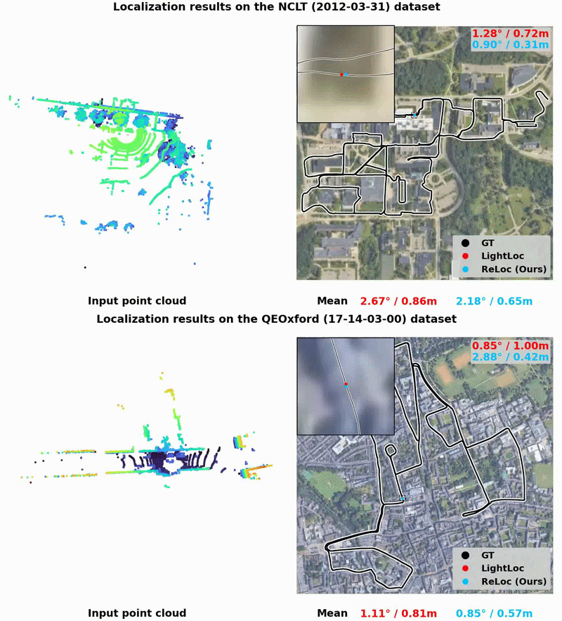

# ReLoc

## ReLoc: Rethinking Scene Coordinate Regression Architecture for Robust Outdoor LiDAR Localization
**Authors:** [Heejoon Moon](https://phantom0122.github.io/), Yurim Cho, [Je Hyeong Hong](https://scholar.google.com/citations?user=7axCcBkAAAAJ&hl=en)




## Abstract
Scene Coordinate Regression (SCR) has recently emerged as a promising approach for LiDAR-based localization, achieving accurate localization without requiring an explicit 3D map. Despite their effectiveness, existing SCR methods rely on scene classification-based global embedding that struggles to provide fine-grained discrimination among nearby locations. Moreover, their reliance on uniform sampling of local features during training assigns equal importance to all points, thereby inadvertently propagating features from dynamic objects or unstable regions and potentially degrading training stability. In this paper, we present ReLoc, a revamped SCR architecture that can effectively address these limitations. First, we redesign the global embedding module by combining learnable context tokens with a feature aggregator to capture richer and more discriminative scene context. Second, we introduce an attention-based local feature enhancement module to mitigate the impact of noisy local features while encouraging context-consistent structures, yielding more robust local feature representations. Experimental results on two large-scale outdoor datasets demonstrate that our approach achieves state-of-the-art accuracy over previous SCR-based methods while maintaining real-time inference performance.

---
## Environment

### Requirements
- python 3.10

- pytorch 2.0.1

- cuda 11.8

- MinkowskiEngine 0.5.4

## Supported Datasets

LightLoc currently supports the following datasets:
- [Oxford Radar RobotCar](https://oxford-robotics-institute.github.io/radar-robotcar-dataset/datasets)
- [NCLT](https://robots.engin.umich.edu/nclt/)

### Dataset Structure
Organize the dataset directories as follows:

- QEOxford
```
data_root
├── 2019-01-11-14-02-26-radar-oxford-10k
│   ├── velodyne_left
│   │   ├── xxx.bin
│   │   ├── xxx.bin
│   │   ├── …
│   ├── velodyne_left_calibrateFalse.h5
│   ├── velodyne_left_False.h5
├── …
```
- NCLT
```
data_root
├── 2012-01-22
│   ├── velodyne_left
│   │   ├── xxx.bin
│   │   ├── xxx.bin
│   │   ├── …
    ├── velodyne_sync
│   │   ├── xxx.bin
│   │   ├── xxx.bin
│   │   ├── …
│   ├── velodyne_left_False.h5
├── …
```
**Note:** 
- We followed the same notation of LightLoc implementation such as '''sample_cls=True''' denotes training the global embedding module. Many thanks to LightLoc for thier code sharing!
- h5 ground truth files are provided in the [LightLoc](https://github.com/liw95/LightLoc/tree/main).
- We use [nclt_process.py](nclt_process.py) to preprocess velodyne_sync to speed up data reading.
```
python nclt_process.py
```

## Train
#### QEOxford

- Train Global Embedding Module
```
python train.py --scene=/data/Oxford/ --sample_cls=True --voxel_size=0.25 --epochs=50 --batch_size=512 --triplet_group_size=4
```
- Train Regressor & Local Feature Enhancement Module
```
python train.py --scene=/data/Oxford/ --classifier_path=log/49_cls_QEOxford.pth --voxel_size=0.25 --epochs=25 --batch_size=256 --triplet_group_size=1
```

#### NCLT
- Train Global Embedding Module
```
python train.py --scene=/data/NCLT/ --sample_cls=True --voxel_size=0.3 --epochs=50 --batch_size=512 --triplet_group_size=4
```
- Train Regressor & Local Feature Enhancement Module
```
python train.py --scene=/data/NCLT/ --classifier_path=log/49_cls_NCLT.pth --voxel_size=0.3 --epochs=30 --batch_size=256 --triplet_group_size=1 
```

## Test
#### QEOxford
```
python test.py --scene=/data/Oxford --classifier_path=pretrained/49_cls_QEOxford.pth --regressor_path=pretrained/24_reg_QEOxford.pth --voxel_size=0.25
```
####  NCLT
```
python test.py --scene=/data/NCLT --classifier_path=pretrained/49_cls_NCLT.pth --regressor_path=pretrained/29_reg_NCLT.pth --voxel_size=0.3
```
**Note:** For results matching Table 3 in the paper, exclude lines 4300–4500 from the 2012-05-26 trajectory.

## Model Zoo
Pretrained models (global embedding modulde, local feature enhancement module, and scene-specific regressor heads) are available for download [here](https://drive.google.com/drive/folders/1aumcbQkiX2matFzVUHKLoCJF-Svj7X56?usp=sharing).


## Citation

```
This code builds on previous LiDAR localization pipelines, namely LightLoc, GTRLoc and FlashMix. Please consider citing:
```
```
@inproceedings{goswami2025flashmix,
  title={Flashmix: Fast map-free LiDAR localization via feature mixing and contrastive-constrained accelerated training},
  author={Goswami, Raktim Gautam and Patel, Naman and Krishnamurthy, Prashanth and Khorrami, Farshad},
  booktitle={2025 IEEE/CVF Winter Conference on Applications of Computer Vision (WACV)},
  pages={2011--2020},
  year={2025},
}

@inproceedings{yu2025gtrloc,
  title={{GTR}-Loc: Geospatial Text Regularization Assisted Outdoor Li{DAR} Localization},
  author={Shangshu Yu and Wen Li and Xiaotian Sun and Zhimin Yuan and Xin Wang and Sijie Wang and Rui She and Cheng Wang},
  booktitle={The Thirty-ninth Annual Conference on Neural Information Processing Systems},
  year={2025}
}

@inproceedings{li2025lightloc,
  title={LightLoc: Learning outdoor LiDAR localization at light speed},
  author={Li, Wen and Liu, Chen and Yu, Shangshu and Liu, Dunqiang and Zhou, Yin and Shen, Siqi and Wen, Chenglu and Wang, Cheng},
  booktitle={Proceedings of the Computer Vision and Pattern Recognition Conference},
  pages={6680--6689},
  year={2025}
}
```
